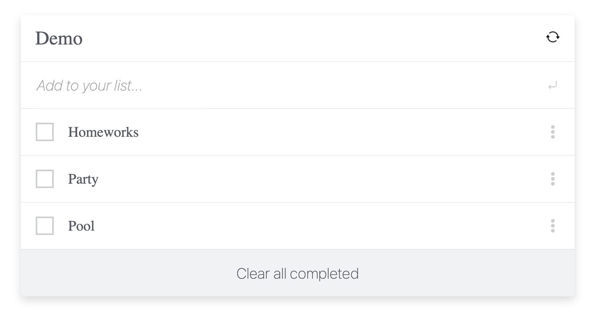

# To Do List

> In this project, I built a simple HTML list of To Do tasks using webpack and served by a webpack dev server.

## Screenshot

## Built With

- HTML
- CSS
- JavaScript
- Webpack

## Getting Started
For a live demo [click here](https://alexr16.github.io/To-Do-list/)
## Getting Started

To get a local copy up and running follow this simple step:

Clone repository to your local machine: `git@github.com:Alexr16/To-Do-list.git`

## Author

👤 **George**

- GitHub: [@Alexr16](https://github.com/Alexr16)

## 🤝 Contributing

Contributions, issues, and feature requests are welcome!

Feel free to check the [issues page](../../issues/).

## Show your support

Give a ⭐️ if you like this project!

## Acknowledgments

- Hat tip to anyone whose code was used
- Inspiration
- etc

## 📝 License

This project is [MIT](./MIT.md) licensed.